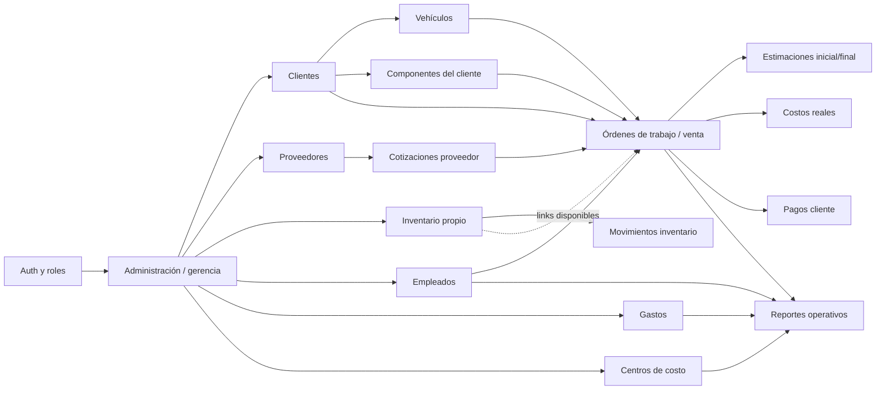
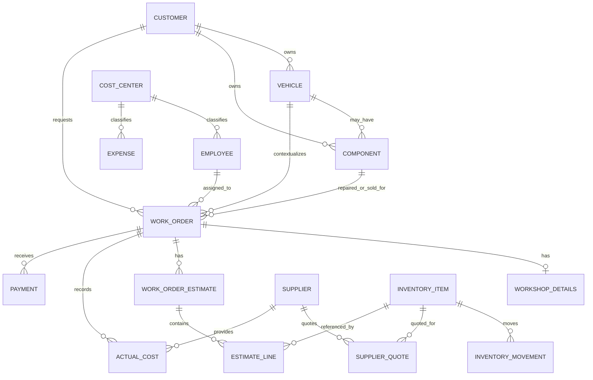
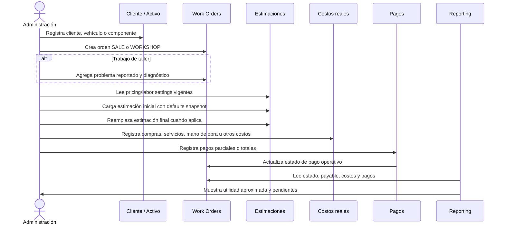
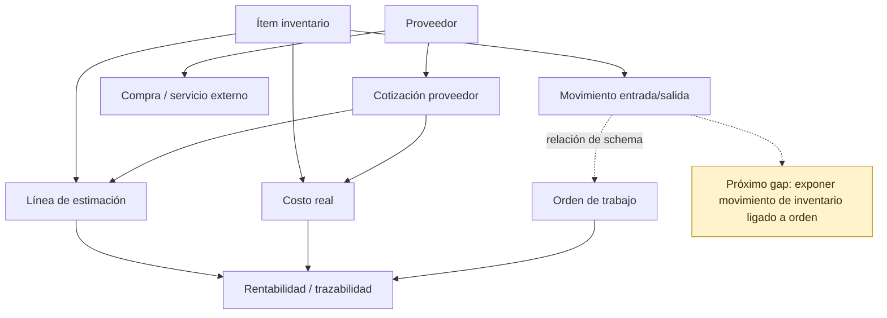
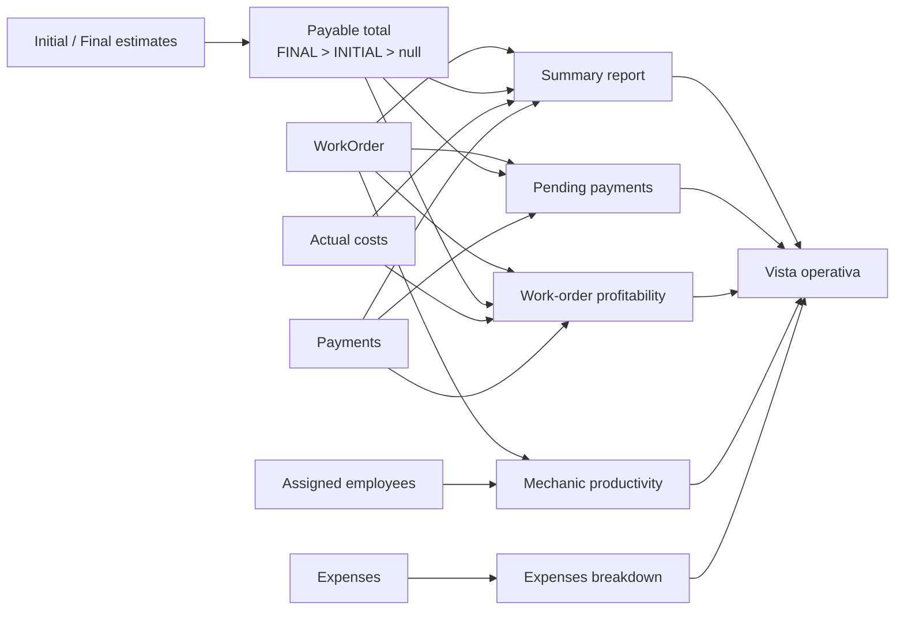
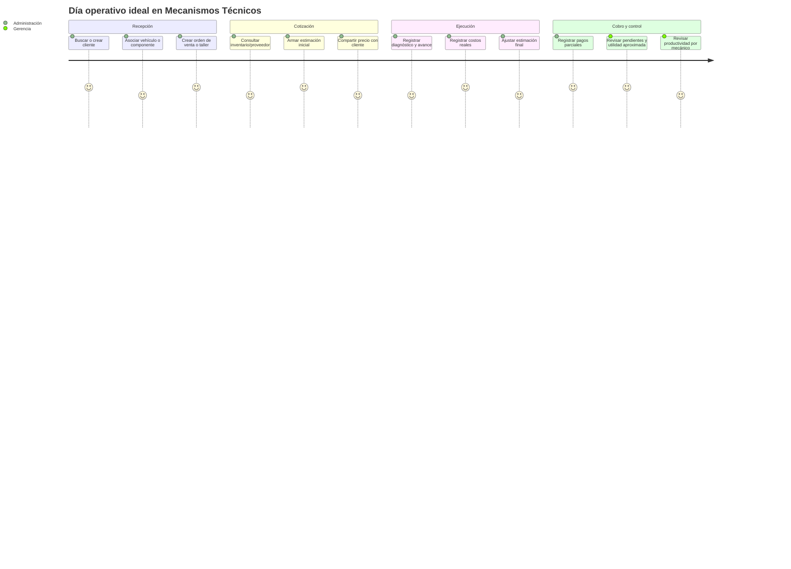

# Mecanismos Dashboard — flujos actuales de la app

Este documento resume cómo está funcionando hoy el backend y cómo debería pensarse el uso diario de la app: la orden de trabajo es el centro operativo; clientes, activos, inventario, proveedores, gastos y empleados alimentan trazabilidad y reportes.

> Los diagramas están en Mermaid. GitHub, VS Code y varios visores Markdown los renderizan como gráficas.

## Lectura rápida

| Área                                    | Estado actual             | Notas                                                                            |
| --------------------------------------- | ------------------------- | -------------------------------------------------------------------------------- |
| Clientes / vehículos / componentes      | Implementado              | Base de trazabilidad de activos del cliente.                                     |
| Inventario / proveedores / cotizaciones | Implementado parcialmente | Existe la base, pero falta conectar mejor movimientos de inventario con órdenes. |
| Órdenes de trabajo                      | Implementado              | Incluye estimaciones, costos reales y pagos.                                     |
| Gastos / empleados / centros de costo   | Implementado              | Alimenta reportes operativos.                                                    |
| Reportes operativos                     | Implementado              | Reporting aproximado, no contabilidad formal.                                    |
| Pricing / labor settings               | Implementado              | Singleton backend con defaults para futuras cotizaciones y snapshots históricos. |
| Próxima brecha fuerte                   | Inventario ↔ órdenes      | Falta el puente operativo para consumo/venta de inventario por orden.            |

## 1. Mapa funcional actual

## 2. Modelo de dominio v1

## 3. Flujo operativo principal: orden de trabajo

## 4. Flujo de inventario y proveedores

El backend ya tiene inventario, proveedores, cotizaciones y movimientos. La brecha actual es convertir eso en un flujo operativo más fuerte dentro de la orden.

## 5. Cómo se alimentan los reportes

## 6. Uso diario imaginado

## 7. Brechas recomendadas antes de nuevos módulos grandes

| Prioridad | Brecha                         | Por qué importa                                                                           |
| --------: | ------------------------------ | ----------------------------------------------------------------------------------------- |
|         1 | Inventario ligado a órdenes    | Cierra trazabilidad de salidas/consumos/ventas y mejora utilidad real.                    |
|         2 | Historial/auditoría de settings | Ya existe singleton actual, pero falta versionado explícito si negocio lo pide. |
|         3 | Nómina simple                  | V1 sólo pide proyección por salario base; conviene después de estabilizar reporting.      |
|         4 | Toolchain Jest/ESM             | VM Modules warning no bloquea, pero es deuda de herramientas.                             |

## Checklist de interpretación

- Los reportes son **operativos y aproximados**, no contabilidad formal.
- Cuando una orden no tiene estimación inicial/final, el payable es `null`, no `0`.
- La productividad de mecánicos usa órdenes asignadas; no descuenta salario, bonos ni overhead.
- No se deben borrar entidades con historia importante; se prefiere preservar trazabilidad.
